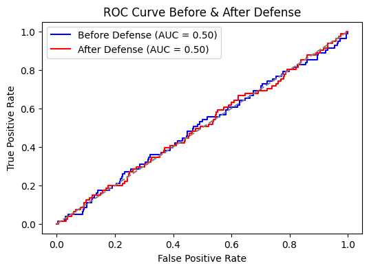

# DataPoisoning-Label-flipping-
Detecting and preventing data poisoning in fraud detection using Label Flipping Attack defense.

#  Fraud Detection Vulnerabilities

->Data Poisoning Threat
Fraud detection models are exposed to data poisoning, leading to misclassification.
->Misclassification Impact
Increased fraudulent transactions are incorrectly classified as legitimate, worsening fraud cases.
->Label Flipping Attack
Implementing a label flipping attack on the fraud detection dataset to evaluate vulnerabilities.
->Detection Mechanism Development
Developing mechanisms to detect and identify poisoned data within the dataset.

#  Fraud Detection & Data Poisoning Defense  

**Detecting & Preventing Label Flipping Attack in Credit Card Fraud Detection**  

---

##  Project Overview  
Machine learning models, especially in **fraud detection**, are vulnerable to **data poisoning attacks**. This project focuses on **Label Flipping Attack**, where **fraudulent transactions are incorrectly labeled as non-fraudulent**, reducing the model’s ability to detect fraud.  

** Objectives:  
- Simulate a **Label Flipping Attack** in a fraud detection dataset.  
- Implement **anomaly detection (Isolation Forest)** to flag poisoned samples.  
- Develop a **correction mechanism** to restore mislabeled fraud cases.  
- Train a **robust fraud detection model** and compare its performance **before and after defense**.  

---

## Model Architecture  

### **End-to-End Workflow for Fraud Detection Defense System**  

##Label Flipping Attack Implementation
A Label Flipping Attack is a type of data poisoning attack where the attacker intentionally mislabels a subset of the training data to degrade the model’s performance.

 How the Attack Works
1️. Select a percentage of fraud samples (e.g., 30%)
2️. Flip their labels from fraud (1) to non-fraud (0)
3️. Train the fraud detection model on poisoned data
4️. Evaluate the model and observe the performance drop

# Expected Impact of the Attack
The fraud detection rate decreases because the model learns incorrect patterns.

The number of missed fraud cases (False Negatives) increases, making fraudsters harder to catch.

The accuracy might remain high due to data imbalance, but fraud detection effectiveness suffers significantly.

 Before vs. After Poisoning (Expected Results)

## Defense System Implementation
To counteract this attack, we implement a three-step defense mechanism:

✅ Step 1: Detect Poisoned Data
Anomaly detection is applied using Isolation Forest, which identifies fraudulent transactions that have been mislabeled.
Transactions with unusual fraud characteristics are flagged as potentially poisoned.

✅ Step 2: Correct Mislabeled Transactions
A secondary fraud detection model is trained on a clean dataset to predict the correct labels for flagged transactions.
Poisoned samples are reclassified to their original fraud labels, reversing the attack's impact.

✅ Step 3: Retrain the Final Fraud Detection Model
A robust fraud detection model is trained on the corrected dataset, ensuring that the model learns accurate fraud patterns.
The model is then evaluated to confirm its resistance to future poisoning attacks.

##  Conclusion
In this project, we demonstrated how data poisoning attacks, specifically the Label Flipping Attack, can severely impact fraud detection models by misleading them into learning incorrect patterns. By flipping fraud labels to non-fraud, the attack reduced the fraud detection rate and increased false negatives, making it easier for fraudulent transactions to go undetected.

To counter this, we implemented a defense mechanism that:
-✔ Detects poisoned transactions using Isolation Forest.
-✔ Corrects mislabeled fraud cases using a secondary clean model.
-✔ Retrains the fraud detection model on a cleaned dataset to restore accuracy.

The results showed that after applying our defense strategy, the fraud detection rate improved significantly, and the model was successfully restored to its original performance.

This research proves the effectiveness of anomaly detection and relabeling strategies in mitigating data poisoning attacks in fraud detection systems.

